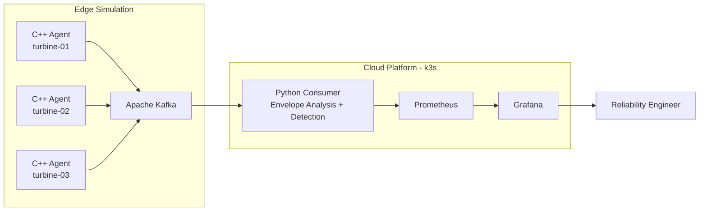

# VIB 
**Vibration Intelligence for Bearings**

Real-time condition monitoring system for detecting bearing faults in wind turbines by streaming vibration data from edge agents to a cloud based detection pipeline.

## Features
- Detects outer race, inner race, rolling element, and cage faults across four fault frequencies (BPFO, BPFI, BSF, FTF)
- Validated against CWRU 6205 benchmark bearing data
- Simulates a fleet of turbines with independant edge agents streaming to a central platform
- Real time fault detection with per turbine Prometheus metrics and Grafana dashboards
- Containerised C++ agents (Docker) and Python consumers (Kubernetes)
- CI pipeline with automated tests

## Architecture



## Tech Stack

| Layer | Technology | Purpose |
|-------|-----------|---------|
| Edge Agent | C++ | Signal generation, Kafka producer |
| Message Broker | Apache Kafka | Decoupled data streaming between edge and cloud |
| Detection | Python (NumPy, SciPy) | Envelope analysis, fault classification |
| Orchestration | Kubernetes (k3s) | Consumer deployment, scaling |
| Containerisation | Docker | Agent packaging, multi-stage builds |
| Observability | Prometheus + Grafana | Metrics collection, dashboards |
| CI | GitHub Actions | Automated testing on every push |
| Build | CMake | C++ build system |


## Quick Start

### Prerequisites
- Docker Desktop
- k3d
- kubectl
- Python 3.10+
- CMake, g++

### Run
```bash
docker compose up -d
k3d cluster create turbine-cms --network turbine-cms_default
docker build -t turbine-consumer python/bearing/
k3d image import turbine-consumer -c turbine-cms
kubectl apply -f k8s/
kubectl port-forward service/grafana 3000:3000
kubectl port-forward service/prometheus 9090:9090
```

## How It Works

### Bearing Fault Detection

Wind turbine bearings produce characteristic vibration patterns when defects develop. Each fault type (outer race, inner race, rolling element, cage) generates impulses at a predictable frequency determined by the bearing geometry and shaft speed.

VIB uses envelope analysis to extract these fault signatures from noisy vibration data:


*Synthetic bearing defect signal - exponentially decaying impulses at BPFO intervals*


*Envelope spectrum showing peaks at BPFO harmonics, confirming outer race fault*
